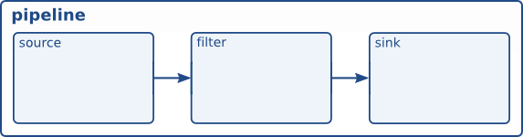

#Review code:



> Element creation

```
/* Create the elements */
source = gst_element_factory_make ("videotestsrc", "source");
sink = gst_element_factory_make ("autovideosink", "sink");
```

New elements can be created with ```gst_element_factory_make()```. The first parameter is the type of element to create. The second parameter is the name we want to give to this particular instance. Naming your elements is useful to retrieve them later if you didn't keep a pointer (and for more meaningful debug output). If you pass NULL for name, howerver, GStreamer will provide a unique name for you.

In this note, two elements are created: a `videotestsrc` and an `autovideosink`

`videotestsrc` is a source element (produce data), which creates a test video pattern.

`autovideosink` is sink element (consume data), which displays on a window the images it receives. There exist serveral video sinks, depending on the operating system, with a varying range of capabilities. `autovideosink` automatically selects and instantiates the best one, so you do not have to worry with the details, and your code is more platform independent.

> Pipeline creation

```
/* Create the empty pipeline */
pipeline = gst_pipeline_new ("test-pipeline");
```

All elements in GStreamer must typically be contained inside a pipeline before they can be used, because it takes care of some clocking and messaging functions. We create the pipeline with ```gst_pipeline_new()```.

```
/* Build the pipeline */
gst_bin_add_many (GST_BIN (pipeline), source, sink, NULL);
if (gst_element_link (source, sink) != TRUE) {
  g_printerr ("Elements could not be linked.\n");
  gst_object_unref (pipeline);
  return -1;
}
```

A pipeline is a particular type of ```bin```, which is the element used to contain other elements. Therefore all methods which apply to bins also apply to pipelines. In our case, we call ```gst_bin_add_many()``` to add the elements to the pipeline. This function accepts a list of elements to be added, ending with NULL. Individual elements can be added with ```gst_bin_add()````.

These elements, howerver, are not linked with each other yet. For this, we need to use ```gst_element_link()```. Its first parameter is the source, and the second one the destination. The order counts, because links must be established following the data flow (this is, from source elements to sink elements). Keep in mind that only elements residing in the same bin can be linked together, so remember to add them to the pipeline before trying to link them!

> Properties

```
/* Modify the source's properties */
g_object_set (source, "pattern", 0, NULL);
```

Most GStreamer elements have customizable properties: named attributes that can be modified to change the element's behavior (writable properties) or inquired to find out about the element's internal state (readable properties).

Properties are read from with ```g_object_get()``` and written to with ```g_object_set()```.

```g_object_set()``` accepts a NULL-terminated list of property-name, property-value pairs, so multiple properties can be changed in one to go.

GStreamer elements are all a particular kind of ```GObject```, which is the entity offering property facilites. This is why the property handling methods have the ```g_``` prefix.

> Error checking

At this point, we have the whole pipeline built and setup, and the rest of the tutorial like note 1, but we are going to add more error checking:

```
/* Start playing */
ret = gst_element_set_state (pipeline, GST_STATE_PLAYING);
if (ret == GST_STATE_CHANGE_FAILURE) {
  g_printerr ("Unable to set the pipeline to the playing state.\n");
  gst_object_unref (pipeline);
  return -1;
}
```

call ```gst_element_set_state``` return value for errors. Changing states is a delicate process.

```
/* Wait until error or EOS */
bus = gst_element_get_bus (pipeline);
msg = gst_bus_timed_pop_filtered (bus, GST_CLOCK_TIME_NONE, GST_MESSAGE_ERROR | GST_MESSAGE_EOS);

/* Parse message */
if (msg != NULL) {
  GError *err;
  gchar *debug_info;

  switch (GST_MESSAGE_TYPE (msg)) {
    case GST_MESSAGE_ERROR:
      gst_message_parse_error (msg, &err, &debug_info);
      g_printerr ("Error received from element %s: %s\n", GST_OBJECT_NAME (msg->src), err->message);
      g_printerr ("Debugging information: %s\n", debug_info ? debug_info : "none");
      g_clear_error (&err);
      g_free (debug_info);
      break;
    case GST_MESSAGE_EOS:
      g_print ("End-Of-Stream reached.\n");
      break;
    default:
      /* We should not reach here because we only asked for ERRORs and EOS */
      g_printerr ("Unexpected message received.\n");
      break;
  }
  gst_message_unref (msg);
}
```

```gst_bus_timed_pop_filtered()``` waits for execution to and returns with a ```GstMessage``` which we previously ignored. It returned when GStreamer encountered either an error condition or an ```EOS```, so we need to check which one happended, and print a message on screen.

```GstMessage``` is a very versatile structure which can deliver virtually any kind of information. Fortunately, GStreamer provides a series of parsing function for each kind of message.

In this case, once we know the message contains an error (by using the ```GST_MESSAGE_TYPE() macro)```, we can use ```gst_message_parse_error()``` which returns a GLib ```GError``` error structure and a string useful for debugging. Examine the code to see how these are used and freed afterward.

> The GStreamer bus

Introducing the GStreamer bus. It is the object responsible for delivering to the application the ```GstMessage```s generated by the elements, in order and to the application thread. This last point is important, because the actual streaming of media is done in another thread than the application.

Messages can be extracted from the bus synchronously with ```gst_bus_timed_pop_filtered()``` and its siblings, or asynchronously, using signals. Your application should always keep an eye on the bus to be notified of errors and other playback-related issues.

> Conclusion

This tutorial showed:

> - How to create elements with ```gst_element_factory_make()```
> - How to create an empty pipeline with ```gst_pipeline_new()```
> - How to add elements to the pipeline with ```gst_bin_add_many()```
> - How to link the elements with each other with ```gst_element_link()```